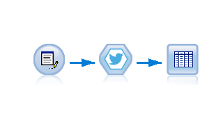
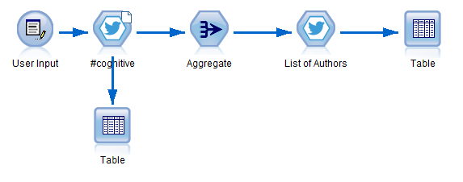
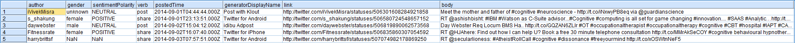

### Receive Twitter Decahose Data

  

---

### Quickstart

1. You need to set up the Insights for Twitter BlueMix Service [here](#https://new-console.ng.bluemix.net/catalog/services/insights-for-twitter).

2. Download and install the [TwitterBlueMix.mpe file](TwitterBlueMix.mpe) in SPSS Modeler or search for 'TwitterBlueMix' in the Predictive Extensions Hub (klick [here](#installation) for detailed instructions).

3. Download the [example stream](example.str) to get started.

  

### How to set up the Insights for Twitter BlueMix Service

### Output

  

### Requirements
* PySpark in Modeler set up
* SPSS Modeler v18.0 or later
* Python installation ([Anaconda](#https://www.continuum.io/downloads) recommended)

### Installation
In SPSS Modeler Click on '**Extensions**' --> '**Install Local Extenstions Bundle...**' and navigate to the [TwitterBlueMix.mpe](TwitterBlueMix.mpe) file in this folder.  
**_or..._**  
In SPSS Modeler Click on '**Extensions**' --> '**Extensions Hub...**', search, '**Facebook Posts**' and click '**Install...**'.

### Packages used
pandas: https://pypi.python.org/pypi/pandas  
numpy: https://pypi.python.org/pypi/numpy
