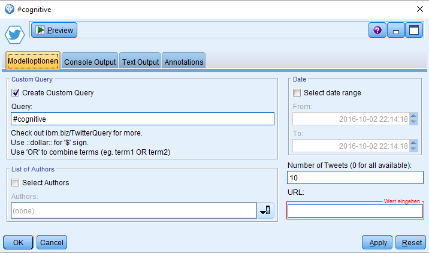

### Receive Twitter Decahose Data
With this extension for IBM SPSS Modeler you are able to receive Twitter Decahose data with powerful queries. Decahose stands for a random 10% sample of Tweets which is sufficient in most use cases. This node leverages the _Insights for Twitter_ Service on BlueMix

  

---

### Quickstart

1. You need to set up the Insights for Twitter BlueMix Service [here](https://new-console.ng.bluemix.net/catalog/services/insights-for-twitter).

2. If you signed up for the Entry Plan of the service, go to your Services --> Insights for Twitter --> Service Credentials --> View Credentials and copy the 'url' from there.

3. Download and install the [TwitterBlueMix.mpe file](TwitterBlueMix.mpe) in SPSS Modeler or search for 'TwitterBlueMix' in the Predictive Extensions Hub (klick [here](#installation) for detailed instructions).

4. Download the [example stream](example.str) and paste your URL from step 2 into the TwitterBlueMix Node to get started.

  

### UI
The user interface gives you the ability to automatically generate straightforward queries.    
You always need to paste your BlueMix Insights for Twitter service URL. Depending on how much Tweets you want to receive, enter a number in the respective field. Type 0 if you want to receive all Tweets available via the Twitter Decahose.
The other three boxes give you the option to select specific search terms, specific authors, and/or specific date ranges.
If you need more advanced queries than provided via the UI, just only check '**Create Custom Query**' and post a more complex query string matching the correct pattern explained here: http://ibm.biz/TwitterQuery.

  

### Output
The output is always a list of Tweets with the following information:    
`"author",
  "gender",
  "sentimentPolarity",
  "verb",
  "postedTime",
  "generatorDisplayName",
  "link",
  "body",
  "favoritesCount",
  "twitter_filter_level",
  "twitter_lang",
  "retweetCount",
  "longitude",
  "latitude",
  "country",
  "city",
  "state"`    

  Some of the fields like `gender` or the geo locations are only filled if known.    
  The `sentimentPolarity` field is provided and pre-scored for you by Twitter. Feel free to compare it with your own sentiment analysis (e.g. I've seen it doesn't recognize doubled negations such as 'not good').    
  The `body` field contains the Tweet itself.

  

### Requirements
* SPSS Modeler v18.0 or later
* PySpark in Modeler set up as outlined [here](http://www.ibm.com/support/knowledgecenter/SS3RA7_18.0.0/modeler_r_nodes_ddita/clementine/r_pyspark_api.html) under the **Prerequisites** section.
* Python installation ([Anaconda](#https://www.continuum.io/downloads) recommended; If you refer to another python installation, make sure to `pip install pandas` and `pip install numpy`).

### Installation
In SPSS Modeler Click on '**Extensions**' --> '**Install Local Extenstions Bundle...**' and navigate to the [TwitterBlueMix.mpe](TwitterBlueMix.mpe) file in this folder.  
**_or..._**  
In SPSS Modeler Click on '**Extensions**' --> '**Extensions Hub...**', search, '**Facebook Posts**' and click '**Install...**'.

### Packages used
pandas: https://pypi.python.org/pypi/pandas  
numpy: https://pypi.python.org/pypi/numpy

### Authors
Jonathan Langefeld - IBM
